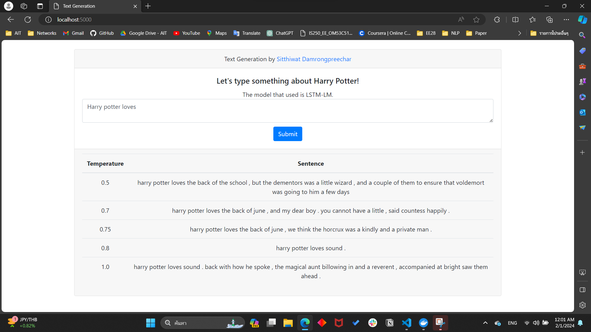

# A2 Text Generation

This project is part of building a LSTM-LM (Long Short-Term Memory Language Model) using a text dataset of Harry Potter. The
objective is to train a model that can generate coherent and contextually relevant text based on a given
input. The project also involves creating a web interface for the text generation.

## LSTM-LM Training Process
The complete training process is detailed within the `A2_st123994.ipynb` notebook, providing in-depth instructions. Feel free to study and build upon this comprehensive guide for a better understanding of the LSTM-LM training.


## Web application with Flask
This web application is built using Flask, a popular web framework in Python. Using Flask, the application integrates a pre-trained LSTM-LM from the training phase. The saved model is imported and loaded into the LSTM-LM class within this application, which is structured similarly to the one in the Jupyter notebook. All functionalities are then executed using the same functions and parameters employed during the training phases.

### Quick Start with Docker Compose

1. **Clone the repository:**
    ```bash
    git clone https://github.com/SitthiwatDam/A2_Text_generation.git
    ```

2. **Navigate to the project directory:**
    ```bash
    cd A2_Text_generation
    ```

3. **Build and run the Docker containers:**
    ```bash
    docker-compose up -d
    ```

4. **Access the application:**
    - Open your web browser and go to [http://127.0.0.1:5000/](http://127.0.0.1:5000/)

<!-- 5. **Submit a search:**
    - Enter a word in the text area.
    - Click the "Submit" button. -->

6. **Stop the application when done:**
    ```bash
    docker-compose down
    ```

### Web Application Interface
For the application interface, users are required to type the prompt into a textarea. After clicking submit, the model will generate five texts that are continuations of the input text, sorted by their temperature.




